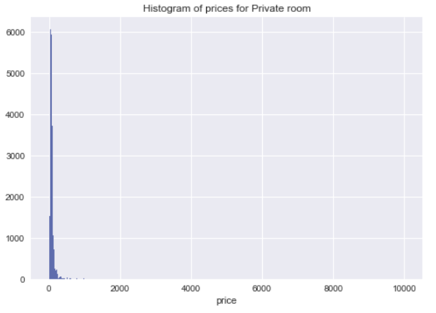
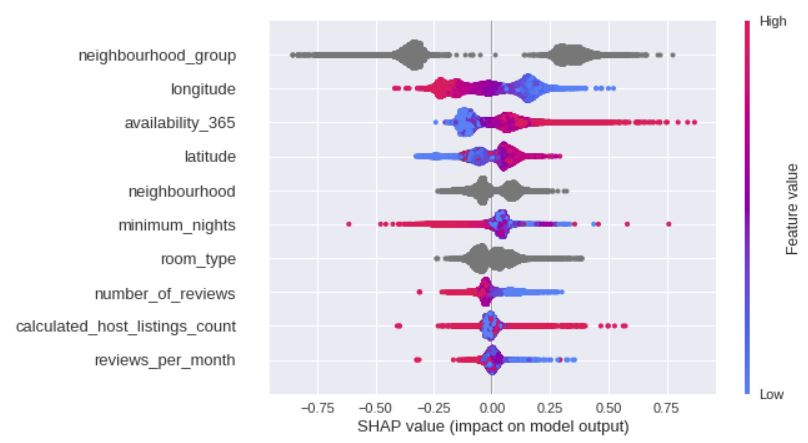
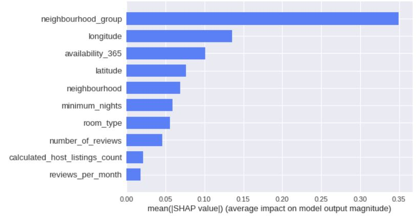
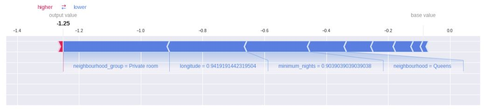

# Predicting Rental Room/House prices from AirBNB data

## Introduction: Problem description and data 
Machine learning is currently one of the most popular fields, used for a variety of tasks but the underlying principle is to identify patterns in data by what we call _training_ from data. Based on the trained machine learning model, we try to predict values of interest for new data, which is not used in the training and usually called the _deployment data set_. In this blog post, we use machine learning techniques to predict the rental room/house prices from AirBNB data for New York city area. This can be useful for people searching for the prices of rentals in certain areas and also for home owners who are trying to estimate the price they can make their homes available for rent. 

The data set we have available for this task is a number of reviews from the users of the AirBNB rentals. These reviews include a set of details associated with them like host name, neighbourhood group, neighbourhood, latitude, longitude, room type, price, minimum nights, year long availability, etc. which in machine learning world are called _features_ that help to create the model. Of course, we are trying to predict the price so that will not be used as a feature. The AirBNB dataset has 48,895 reviews and 16 features. From the data, we can visualize features of interest, for example the histogram below shows the prices for a "private room". In most cases the usual prices seem to be in the range of \\$0 - \\$400. There are some extreme values like \\$10,000 corresponding to 1 review, these are called _outliers_.  


 

## Machine Learning models development

There are many different models in machine learning and in general there is no best model which works for all problems. So a few models are tested out to get the most suitable model for the problem. The implementations of these machine learning models are available in a popular Python machine learning library called [scikit learn](https://scikit-learn.org/stable/) which we use for the analysis.

**Hyperparameters of a model** <br/>
Every model has certain parameters which can be set beforehand. We can think of these like certain screws we tighten, so that the model is fixed properly. These are called _hyperparameters_ of the model. In scikit learn, every model has some "default" hyperparameters. We can also tune these hyperparameters according to the performance of the model on the data. This is where we need to separate out a part of the data for validation.

**Splitting into train, validation and test set** <br/>
During the training process, we need to find a way to evaluate our model, before we directly use it for deployment data. For this purpose, part of the data is set aside for validation. This is called the _validation set_. Once the model is trained, we can use the validation set to check the accuracy. This is usually also done to tune the hyperparameters by taking combinations of them and finding the set of hyperparameters that give the best accuracy. Another way to tune hyperparameters is by using the [RandomizedSearchCV](https://scikit-learn.org/stable/modules/generated/sklearn.model_selection.RandomizedSearchCV.html) method, which is available in scikit learn. This method is used for the present modeling to find the best hyperparameters. In addition to the validation set, another part of the dataset is separated out for one time evaluation after validation is done. This is like a final evaluation before using the model on deployment data. This set is called a _test set_. To summarize, the data is split into three parts, one each for: training, validation and testing. We used 10% of the data for testing, 25% of data for validation and the remaining for training.    

**Numerical and Categorical features** <br/>
Numerical features have numerical values. Some features do not have numerical values, instead they have a classification. For example, the "room type" feature can have categories like "Private room" or "Entire home/apt". These features are called _categorical_ features.

**Encoding for Categorical features** <br/>
Before we use categorical features for modeling, we need to convert them to numerical values based on some criteria. This is commonly called as _encoding_. A popular method for doing this is [OneHotEncoder](https://scikit-learn.org/stable/modules/generated/sklearn.preprocessing.OneHotEncoder.html) which is also a package available in scikit learn.

**Preprocessing** <br/>
There are usually a set of pre-processing steps carried out to make the data "ready" for modeling. These can again be carried out using packages from scikit learn. For the present modeling task, the following pre-processing steps were applied:
- Imputing: this is one way for filling in missing values in the data
- Scaling: to ensure all feature values are of comparable magnitude, so that features with higher values are not influencing the solution.

**Models tested** <br/>
 We chose to use the following models for the prediction task above: 
- `DummyRegressor`
- `HuberRegressor`
- `XGBRegressor`
- `LGBMRegressor`
- `CatBoostRegressor`
- `RandomForestRegressor`

A few points to note from the above models:<br/>
- `DummyRegressor` is our baseline model, which gives the minimum amount of accuracy we need to get from the model.
- `HuberRegressor` is a method which is robust to outliers and hence suitable for our model.
- `CatBoostRegressor` does not need OHE to be done for the categorical features. It handles them automatically. 
- The remaining methods are also good popular methods of regression that we checked.


## Results from the model

### Accuracy obtained
Since we are predicting the prices, we need a measure to see how well the model is performing. For this the price feature of the true data and the predicted values need to be compared. For the models selected this is given by the _accuracy_ which can be found from the _model score_ in scikit learn. This score is called $R^2$ score, which is for example, described [here](https://scikit-learn.org/stable/modules/generated/sklearn.linear_model.SGDRegressor.html). As an initial run, the accuracy obtained for the validation set for the different models is checked and is shown in the table below: 

| Model | Accuracy (Validation set) |
| --- | --- | 
| `DummyRegressor` | -0.00038 |
| `HuberRegressor` | 0.428 |
| `XGBRegressor`   | 0.600 |
| `LGBMRegressor` | 0.602 |
| `CatBoostRegressor` | 0.608 |
| `RandomForestRegressor` | 0.586 |

Since the validation accuracy for  LGBMRegressor and CatBoostRegressor were very close, we selected these two models and performed hyperparameter tuning to get the best scores for these models, by using the RandomizedSearchCV method as mentioned before. The results for accuracy after tuning the hyperparameters are given in the table below, for both the training and the validation set.

| Model |  Accuracy (Training set) | Accuracy (Validation set) |
| --- | --- | --- | 
| `LGBMRegressor` | 0.597 | 0.603 |
| `CatBoostRegressor` | 0.606 | 0.614 |

From the above table, it can be seen that `CatBoostRegressor` gives the highest accuracy for the validation set and hence it is the chosen model for this task. As a final run, this `CatBoostRegressor` model is used to get the accuracy of the test set. The results are shown in the table below: 

| Model |  Accuracy (Training set) | Accuracy (Validation set) | Accuracy (Test set) |
| --- | --- | --- | --- |
| `CatBoostRegressor` | 0.605 | 0.614 | 0.627 |

A very important concept in machine learning is we need to make sure that the model is not perfectly tuned to the training data. That is the model should not cater to predicting only for the training data, otherwise the model is said to be _overfitting_ the training data, and makes it non-generalizable to the test, validation or deployment set. From the above results for the final `CatBoostRegressor` model, it can be seen that the training accuracy is about right and indeed the validation and test accuracy are slightly higher than the training accuracy. This is an indicator of a decently good model that is not overfitting.

### Feature importances and qualitative interpretation of results through visualization
Checking the importance of features is a good approach to analyze the model and try to understand the results. For example, which features play an important role in the modeling and how well it is influencing the solution compared to others. The following discussion pertains to this. Modern tools in scikit learn help us to get this kind of model interpretability through _feature importances_ and better visualization techniques like _SHAP_. For our model the following importances are obtained for the features:

| Feature |Importance |
| --- | --- | 
|neighbourhood_group|37.536487|
|availability_365|11.005538|
|longitude|8.660905|
|minimum_nights|8.219935|
|latitude|7.756844|
|room_type|6.577088|
|number_of_reviews|5.864991|
|calculated_host_listings_count|5.099898|
|neighbourhood|4.979768|
|reviews_per_month|4.298546|

From the above table it can be seen that the feature "neighbourhood_group" has the highest feature importance and plays an important role in influencing the price for the AirBNB rental. The second most important feature is "availability_365" which shows whether the rental room/house is available year long. Looking at the results, these seem to be reasonably good choices which dictate the prices of the AirBNB rentals. 

SHAP value is another parameter which indicates the importance of a feature. The figures below show the SHAP values and the mean of absolute SHAP values for the features, sorted by importance. Apart from the features "neighbourhood_group" and "availability_365" we can see that "longitude", "latitude" and "neighbourhood" also have higher importance (top 5 features) according to SHAP, which is agreeable as it shows the importance of location for the price.

 

 

In a similar fashion, the SHAP plot below shows a clear visualization of the main factors that are contributing to the prediction. 

 

The above discussions and visualizations show the main features that influence prediction and that the modeling is accurate enough since the results make sense. 

## Discussion on limitations

The above model is a reasonable model that we obtained by testing different methods, tuning hyperparameters, interpreting and visualizing results to make sure they make sense. Although, there are still some caveats that can make the above model less suitable in real world. These are described below:
- Accuracy of the models is low, the maximum accuracy we got is 0.627 from the `CatBoostRegressor` for the test set. This can be due to multiple reasons. We have not done a comprehensive analysis for model selection, using other methods like SVM's (linear or non-linear). We should have tested much more models to make sure this is a limitation of the data rather than the machine learning model. 
- We are not sure if the dataset has examples which are more or less distributed to account for all features and are not biased towards a few of the features. Other measures to judge the model, like precision and recall, described [here](https://scikit-learn.org/stable/auto_examples/model_selection/plot_precision_recall.html), might add to better interpretation of results.
- Looking at the feature importances table "neighbourhood" feature has an importance of 4.97, which is quite low compared to "neighbourhood_group" which has an importance of 37.53. This is a big difference, given that both should be important for predicting the prices. We are not quite sure why this discrepancy is showing. Although from the SHAP values, "neighbourhood" is also in the top 5 important features, which seems to be correct. 
- We do not know how complete the dataset is; it might not have certain other features that might be important like attached bathroom, etc., which will definitely influence the price.


## Conclusion

A machine learning model for predicting the prices for the AirBNB rental in NYC area is presented. This would be helpful for people who are searching for rental accomodation and also for home owners who are trying to estimate the price for giving the rental. The `CatBoostRegressor` performs well compared to other models and gives an accuracy of 0.627 on the test set. Analysis of the results is given by showing feature importances and clear visualizations of the results. Some precautions should be taken while using the model, as it has some limitations and a more rigorous analysis should be carried out to overcome these limitations. 


```python

```
